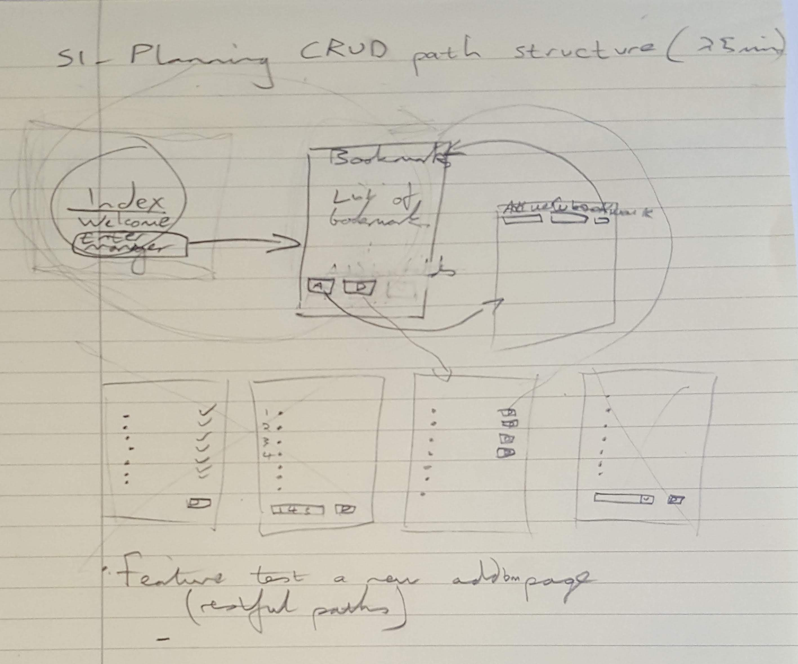
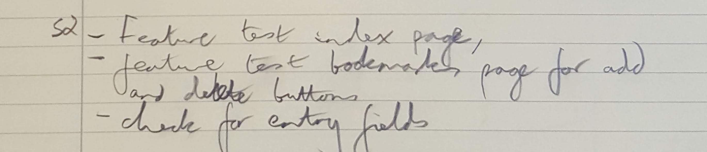
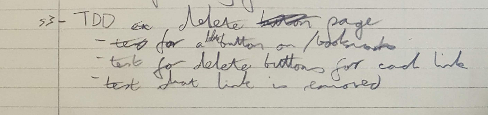
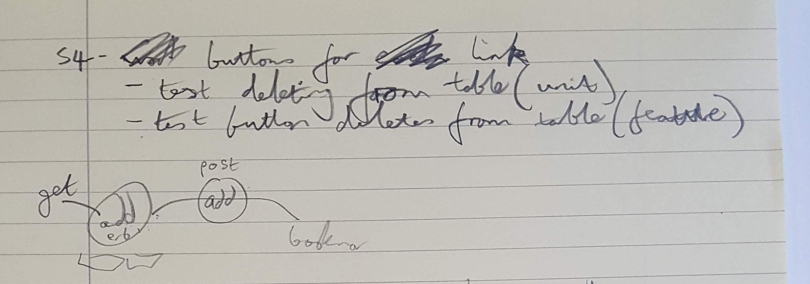
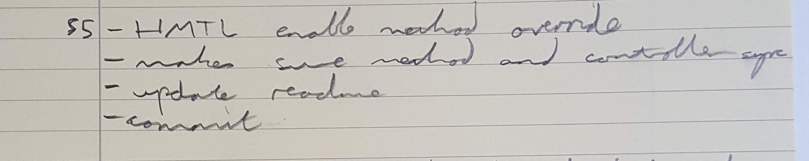
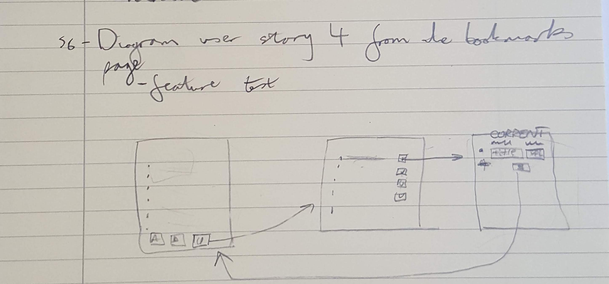

# Bookmark Manager

The website will have the following specification:

- Show a list of bookmarks
- Add new bookmarks
- Delete bookmarks
- Update bookmarks
- Comment on bookmarks
- Tag bookmarks into categories
- Filter bookmarks by tag
- Users are restricted to manage only their own bookmarks

Learning objectives

* Attach a database to a web application
* Setting up a testing environment for web application with a database

For more writing on this challenge and it's topics, see https://medium.com/@n3ttl3t/title-94625a9ad8bf.
---

**CRUD**
(**c**reate, **r**ead, **u**pdate, and **d**elete)

The specification for this program includes these features, which are standard responsibilities for a model. The user stories will implement them, and here are the easiest ways to do them in SQL:

**Create**

* Insert a row:
```
INSERT INTO bookmarks(url) VALUES('http://www.makersacademy.com');
```
* Insert a row with multiple columns:
```
INSERT INTO bookmarks (url, title)
VALUES ('http://www.askjeeves.com','askjeeves');
```
* Insert multiple rows with multiple values:
```
INSERT INTO bookmarks (url, title)
VALUES('http://google.com','Google'),
('http://youtube.com','Youtube');
```

**Read**

* View all the records in a table:
```
SELECT * FROM bookmarks;
```
* Limit the number of records viewed to the top two:
```
SELECT * FROM bookmarks LIMIT 2;
```

* View specific data:
```
SELECT * FROM bookmarks
WHERE url = 'http://www.makersacademy.com';
```

**Update**

* To replace part of a record:
```
UPDATE bookmarks
SET url = 'http://www.destroyallsoftware.com'
WHERE url = 'http://www.askjeeves.com';
```

**Delete**

* To remove a record:
```
DELETE FROM bookmarks
WHERE url = 'http://www.twitter.com';
```
* To remove all the records:
```
DROP TABLE bookmarks
```
---

### User Story 1

```
As a user,
So I can view websites that I think are interesting,
I'd like to see a list of my saved websites.
```


**SETTING UP A DATABASE FOR THE MODEL TO TALK TO**
* Install PostgreSQL - used `brew install postgresql`
* Started PostgreSQL via `brew services start postgresql`
* Enter postgres through `psql postgres`
* Create a database `CREATE DATABASE bookmark_manager`
* Show databases `\l`
* Connect to a database `\c bookmarks`
* Create a new table. Where `id` is the primary key and `url` has a varchar of 60:
```
CREATE TABLE bookmarks(id SERIAL PRIMARY KEY, url VARCHAR(60));
```
* Show table `\dt`
* Delete a table `DROP TABLE bookmarks;`

* Commands beginning with a \ are psql-specific commands (e.g. connecting to databases using \c).
* Everything else is part of SQL (e.g. SELECT * FROM ...), so can be used with any SQL-based Relational Database.
* to display details of a table `\d`.

* [Postgres cheatsheet](http://www.postgresqltutorial.com/postgresql-cheat-sheet/)
* [PostgreSQL Command Line Cheat Sheet 2](https://blog.jasonmeridth.com/posts/postgresql-command-line-cheat-sheet/)

---

**ATTACHING A DATABASE TO A WEB APPLICATION**

* install the `pg` gem. This is the Ruby interface to the PostgreSQL.

* Ruby code to draw data from a database. First of all run `require 'pg'` at the top of the file. Followed by this code in the class file:
```
# this assigns the 'bookmark_manager' database to 'conn'
conn = PG.connect(dbname: 'bookmark_manager')
# this extracts the table from 'bookmark_manager' and assigns it to 'result'
result = conn.exec("SELECT * FROM bookmarks;")
# this extracts the 'url' column and pushes to an array
result.map { |bookmark| bookmark['url'] }
```


**INSTALLING AND CONNECTING TABLE PLUS**
* `psql`, `pg` and `TablePlus` are interfaces to the `PostgreSQL` server. Tableplus is a gui for easy interaction with databases.
* `PostgreSQL` server is running 'backgrounded' on the local machine, by default on `Port 5432`.
* Where it is -> localhost (i.e. your PostgreSQL server is running 'backgrounded' on your local machine, on Port 5432).
* What login details are required -> Your computer's name as a username (or, you can find this out by listing databases in psql), and no password. (i.e. `student`)
* What database should it start with -> The bookmark_manager database.

**SETTING UP A TESTING ENVIRONMENT**

There are multiple environments in applications:
 * A **development** environment that runs locally on your computer, so you can click around it and work on it.
 * A **production** environment that runs remotely on someone else's computer, so other people on the internet can click around it.
 * A **test** environment that runs locally on your computer whenever you run your tests. It comes into being especially for your tests, and disappears straight after your tests finish.
 * Additionally a **staging** environment, where your application runs remotely on someone else's computer, at a secret link so you can click  around it to check it's all working before it's moved to production.


 To set up a test environment:
 * Set up a database for our test environment.
 * In the spec helper, set up an Environmental Variable to tell the application to start in the test environment.
 * Write a script that sets up the testing environment (resets the database) before our tests run.
 * In the model that is responsible for CRUD, reference the environment variable to know which database to use.

 ---

### User Story 2

 ```
 As a user,
 So I can remember more bookmarks,
 I'd like to be able to add to my list.
 ```

 Add more to my list
 - Go to add page
 - Insert text of URL into a table
 - Click submit button
 - See bookmark page with new bookmark


 ---

### User Story 3

```
As a user,
So i can remove a bookmark,
I want options to choose which to delete
```

Decided to change the structure of the program at this stage:



After planning the change we figured out what tests to do:



Then we could move on to feature testing for this user story:



This took more than we expected and had to do some further research:



Eventually we figured out what we needed to do to enable the delete method:



* Using the DELETE method in html is not fully supported, so:
  * we need to enable :method_override
  ```
  enable :method_override
  ```
  * we add a hidden input
  ```
    <input type='hidden' name='_method' value='DELETE'>
  ```
  * pass the query to action
  ```
  <form action='/bookmarks/<%=bookmark.id%>' method='post'>
  ```
  * we use that query in the controller
  ```
  delete '/bookmarks/:id' do
    Bookmark.delete_from_database(params[:id])
  ```
---

### User story 4

```
As a user,
So I can edit a bookmark,
I want to be able to change the title and url.
```



This is as far as we got. Using the detailed planning process definitely helped us understand what we were doing.
